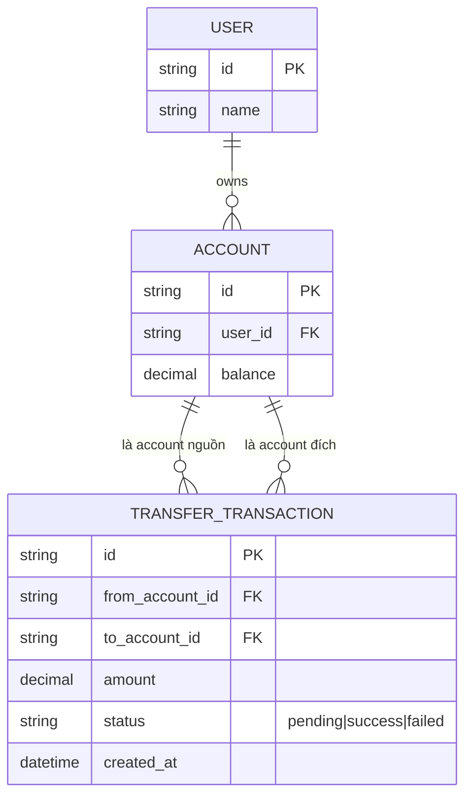

# Base ERD — Chuyển tiền nội bộ chưa có cơ chế chống deadlock

Đây là **base**: trạng thái hệ thống ngân hàng số *trước khi* áp dụng thứ tự lock cố định, retry và logging deadlock. Suy luận từ đề bài, base đã có `USER` sở hữu nhiều `ACCOUNT`, và mỗi lệnh chuyển tiền tạo 1 `TRANSFER_TRANSACTION` tham chiếu tới account nguồn và account đích. Base chưa có bất kỳ cơ chế nào để tránh deadlock khi 2 giao dịch ngược hướng chạy song song, cũng chưa ghi log chi tiết khi transaction bị lỗi.

