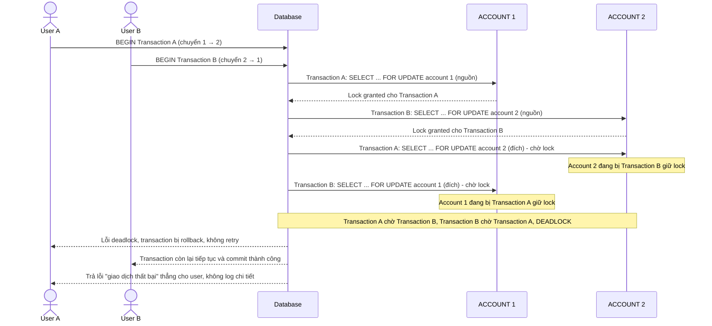

# Base sequence — Transfer money (lock theo thứ tự nguồn trước, đích sau, dẫn tới deadlock)

Đây là **base**, flow chuyển tiền ở trạng thái hiện tại: mỗi transaction lock account nguồn trước rồi mới lock account đích, theo đúng thứ tự tham số truyền vào chứ không chuẩn hóa. Đây chính là kịch bản gây deadlock kinh điển nêu ở yêu cầu 1 của đề bài, khi transaction A chuyển 1 → 2 và transaction B chuyển 2 → 1 chạy đồng thời.

