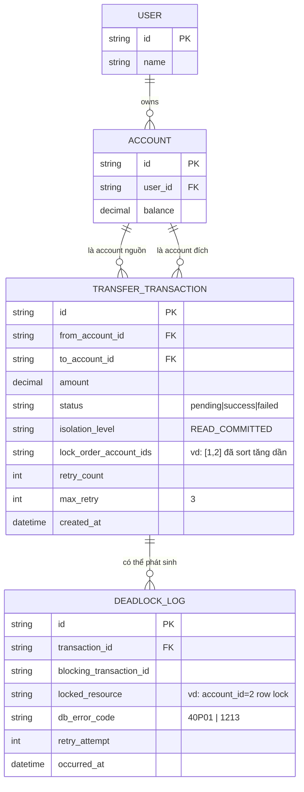

# Enhance ERD — Thêm thứ tự lock cố định, retry và deadlock logging

Đây là ERD **sau khi** enhance được áp dụng lên base. So với base, `TRANSFER_TRANSACTION` thêm các trường theo dõi isolation level và số lần retry, và có thêm entity mới `DEADLOCK_LOG` để ghi chi tiết mỗi lần deadlock xảy ra, ứng trực tiếp với các yêu cầu:

- `TRANSFER_TRANSACTION.isolation_level` và `lock_order_account_ids` — đáp ứng yêu cầu 1 (lock theo account_id tăng dần) và yêu cầu 2 (chọn READ COMMITTED tường minh thay vì mặc định REPEATABLE READ).
- `TRANSFER_TRANSACTION.retry_count`/`max_retry` — đáp ứng yêu cầu 3 (retry tự động tối đa 3 lần khi gặp lỗi deadlock).
- `DEADLOCK_LOG` (mới) — đáp ứng yêu cầu 5 (log đầy đủ transaction nào, lock gì, thời điểm), dữ liệu này cũng phục vụ test invariant ở yêu cầu 4.

