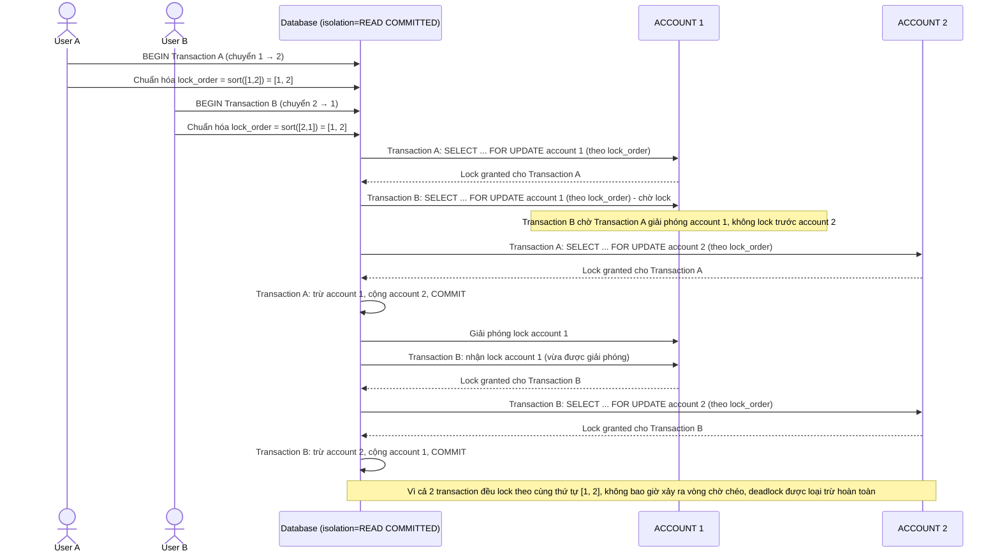

# Enhance sequence — Transfer money (lock theo account_id tăng dần, loại trừ deadlock)

Đây là **enhance** của flow `transfer-money` đã có ở base. So với base (lock theo thứ tự nguồn trước - đích sau gây deadlock), nay cả transaction A và B đều chuẩn hóa thứ tự lock theo `account_id` tăng dần trước khi lock, bất kể chiều chuyển tiền, đồng thời dùng isolation level `READ COMMITTED` tường minh. Đáp ứng yêu cầu 1 và 2 của đề bài.

