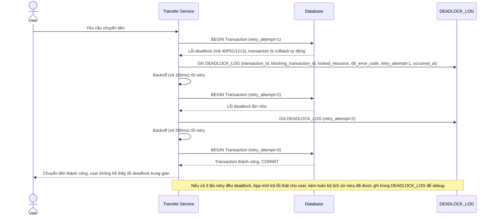

# Enhance sequence — Retry tự động và log chi tiết khi vẫn xảy ra deadlock

Đây là **enhance**, flow mới bổ sung cho trường hợp deadlock vẫn xảy ra dù đã chuẩn hóa thứ tự lock (ví dụ do các transaction khác cạnh tranh lock ngoài dự kiến, hoặc index lock phụ). Đáp ứng yêu cầu 3 (retry tự động tối đa 3 lần với backoff, không để lỗi văng lên user) và yêu cầu 5 (ghi log đầy đủ transaction nào, lock gì, thời điểm) của đề bài.

