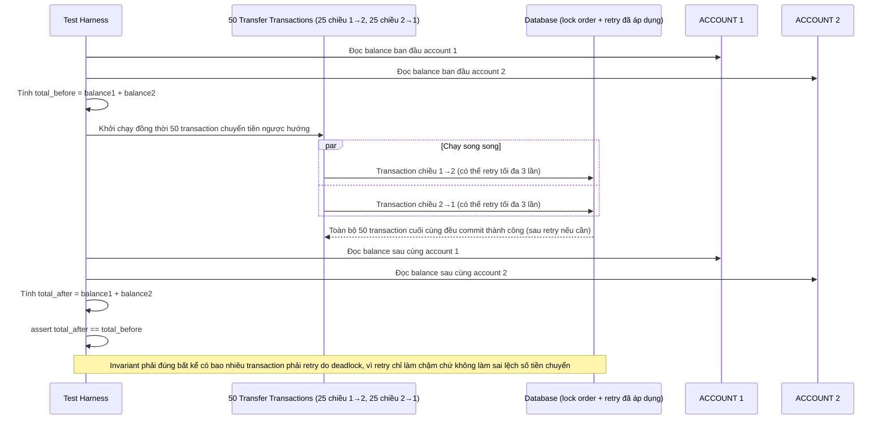

# Enhance sequence — Test giả lập 50 giao dịch ngược hướng, assert invariant tổng số dư

Đây là **enhance**, flow mới mô tả kịch bản test tự động hoá. Đáp ứng yêu cầu 4 của đề bài: viết test giả lập 50 giao dịch chuyển tiền ngược hướng chạy song song giữa 2 account, rồi assert rằng tổng số dư 2 account trước và sau không đổi, dù có transaction phải retry hay không.

