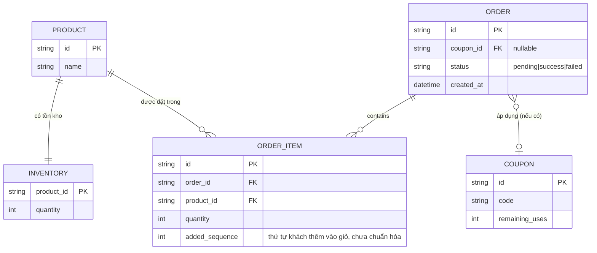

# Base ERD — Checkout chưa chuẩn hóa thứ tự lock

Đây là **base**: trạng thái hệ thống e-commerce *trước khi* áp dụng thứ tự lock cố định toàn cục. Suy luận từ đề bài, base đã có `PRODUCT`/`INVENTORY` (tồn kho theo sản phẩm), `ORDER`/`ORDER_ITEM` (đơn hàng và các dòng sản phẩm trong đơn), và `COUPON` (mã giảm giá dùng 1 lần, giới hạn số lượt). `ORDER_ITEM` có trường `added_sequence` ghi lại đúng thứ tự khách thêm sản phẩm vào giỏ — và trong base, code trừ tồn kho lại đi theo đúng thứ tự này (không chuẩn hóa), chính là nguồn gốc rủi ro deadlock nêu ở đề bài.

