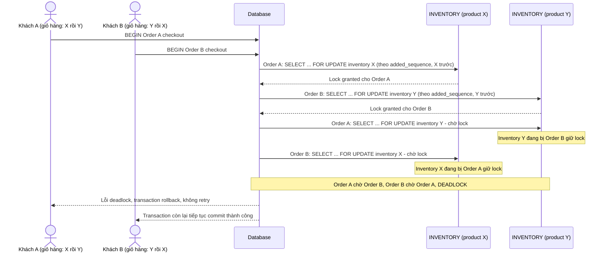

# Base sequence — Checkout (trừ tồn kho theo thứ tự giỏ hàng, gây deadlock chéo sản phẩm)

Đây là **base**, flow checkout ở trạng thái hiện tại: code trừ tồn kho theo đúng `added_sequence` (thứ tự khách thêm vào giỏ), không sort lại theo `product_id`. Đây chính là kịch bản deadlock kinh điển nêu ở yêu cầu 1 của đề bài — đơn hàng A thêm X trước Y, đơn hàng B thêm Y trước X, chạy đồng thời.

