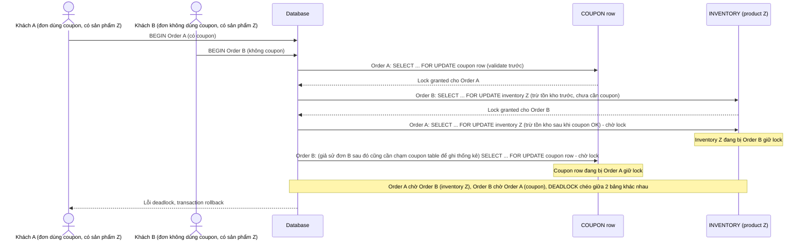

# Base sequence — Checkout với/không coupon (thứ tự lock khác nhau giữa 2 nhánh)

Đây là **base**, flow checkout khi 2 nhánh code (đơn dùng coupon và đơn không dùng coupon) lock tài nguyên theo thứ tự khác nhau: nhánh dùng coupon validate/lock coupon trước rồi mới trừ tồn kho, nhánh không dùng coupon trừ tồn kho trước rồi mới ghi order. Đây là kịch bản rủi ro cross-table nêu ở yêu cầu 2 của đề bài.

