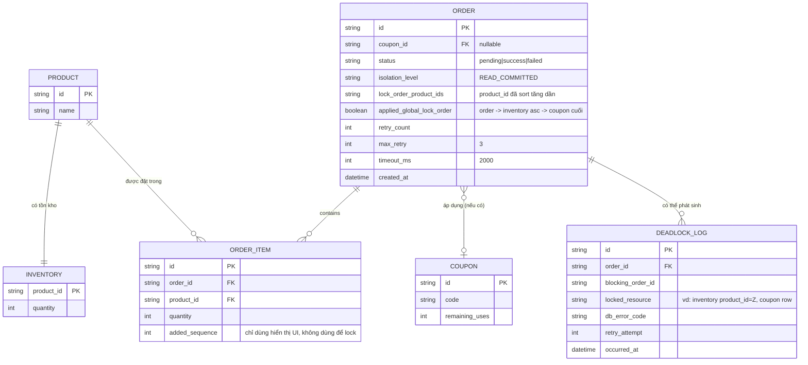

# Enhance ERD — Thứ tự lock cố định toàn cục, retry, timeout và deadlock logging

Đây là ERD **sau khi** enhance được áp dụng lên base. So với base, `ORDER_ITEM` không còn dùng `added_sequence` để quyết định thứ tự lock (giữ lại chỉ để hiển thị UI), `ORDER` thêm các trường kiểm soát isolation/retry/timeout, và có thêm entity mới `DEADLOCK_LOG`, ứng trực tiếp với các yêu cầu:

- `ORDER.lock_order_product_ids` — đáp ứng yêu cầu 1 (sort product_id tăng dần trước khi lock, bất kể thứ tự giỏ hàng).
- `ORDER.isolation_level`, `ORDER.applied_global_lock_order` — đáp ứng yêu cầu 2 (thứ tự lock cố định toàn cục: order row → inventory rows tăng dần → coupon row cuối cùng, áp dụng nhất quán cả 2 nhánh có/không coupon) và yêu cầu 4 (READ COMMITTED + FOR UPDATE tường minh).
- `ORDER.retry_count`, `max_retry`, `timeout_ms` — đáp ứng yêu cầu 3 (retry tối đa 3 lần, timeout 2 giây/transaction).
- `DEADLOCK_LOG` (mới) — ghi chi tiết mỗi lần deadlock, phục vụ debug và test invariant ở yêu cầu 5.

