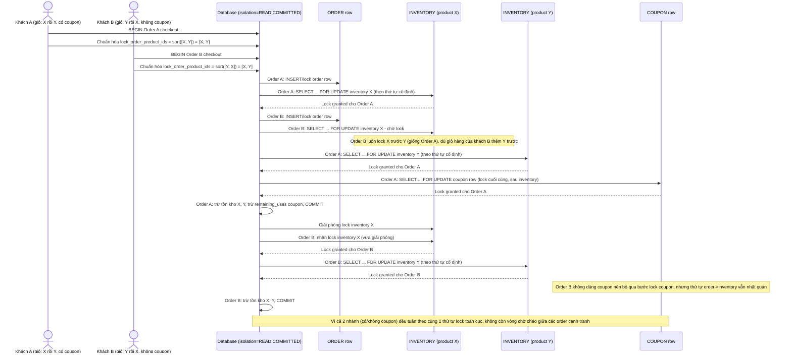

# Enhance sequence — Checkout (thứ tự lock cố định toàn cục: order → inventory tăng dần → coupon)

Đây là **enhance** của flow `checkout` đã có ở base, gộp cả 2 kịch bản base (deadlock chéo sản phẩm và deadlock chéo bảng coupon/inventory). So với base, mọi transaction checkout — dù có dùng coupon hay không — đều tuân theo đúng 1 thứ tự lock cố định: order row trước, rồi inventory rows theo `product_id` tăng dần (bỏ qua `added_sequence`), rồi coupon row lock sau cùng. Dùng isolation `READ COMMITTED` kèm `SELECT ... FOR UPDATE` tường minh theo đúng thứ tự này. Đáp ứng yêu cầu 1, 2 và 4 của đề bài.

