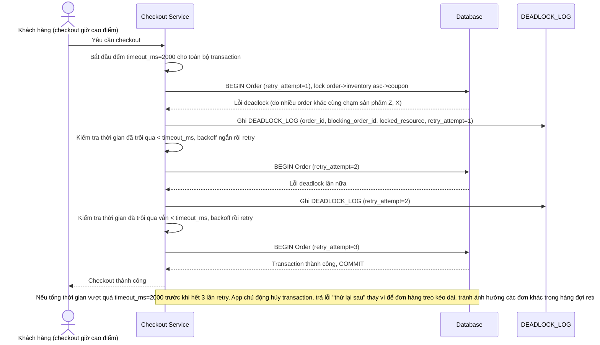

# Enhance sequence — Retry với backoff và timeout tối đa cho checkout mùa sale

Đây là **enhance**, flow mới mô tả tình huống mùa sale: nhiều đơn hàng chứa sản phẩm trùng lặp một phần (đơn A có X, Y, Z; đơn B có Z, X) chạy trong vài giây cao điểm, vẫn có thể phát sinh deadlock dù đã chuẩn hóa thứ tự lock (do độ trễ, lock chờ chồng chéo nhiều đơn). Đáp ứng yêu cầu 3 của đề bài: retry tự động tối đa 3 lần với backoff, và giới hạn timeout 2 giây cho toàn bộ transaction checkout.

