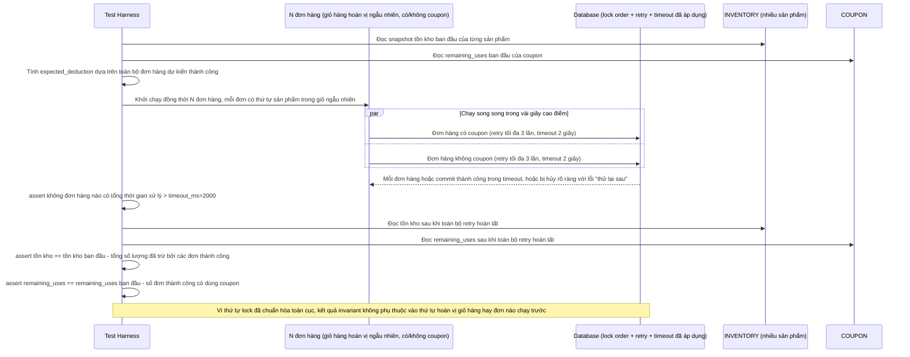

# Enhance sequence — Test giả lập checkout hoán vị giỏ hàng ngẫu nhiên, có/không coupon

Đây là **enhance**, flow mới mô tả kịch bản test tự động hoá. Đáp ứng yêu cầu 5 của đề bài: giả lập nhiều đơn hàng với thứ tự sản phẩm trong giỏ được hoán vị ngẫu nhiên (bao gồm cả có/không dùng coupon), xác nhận không transaction nào treo quá timeout và invariant tồn kho + số lượt dùng coupon còn lại luôn đúng sau khi mọi retry hoàn tất.

