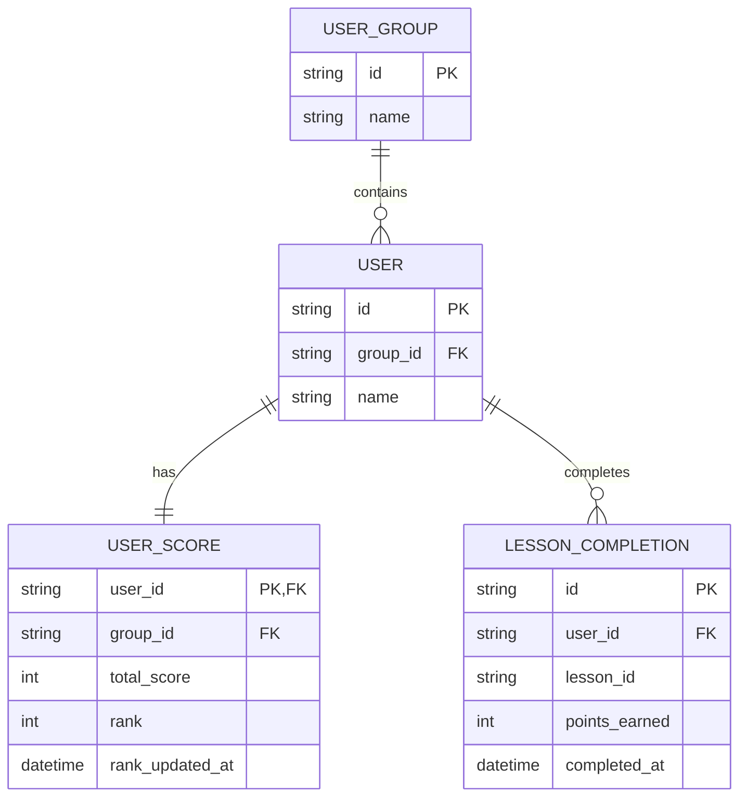

# Base ERD — Điểm số và leaderboard chưa có cơ chế chống deadlock

Đây là **base**: trạng thái hệ thống app học tập gamification *trước khi* áp dụng thứ tự lock theo batch nhỏ, retry và lock timeout. Suy luận từ đề bài, base đã có `USER_GROUP` (nhóm/lớp), `USER` thuộc 1 nhóm, `USER_SCORE` lưu điểm và rank hiện tại của từng user, và `LESSON_COMPLETION` ghi nhận mỗi lần hoàn thành bài học (nguồn cộng điểm). Base chưa phân biệt cách job tính rank và transaction cộng điểm truy cập `USER_SCORE`, cả 2 đều thao tác trực tiếp không có chiến lược tránh tranh chấp.

