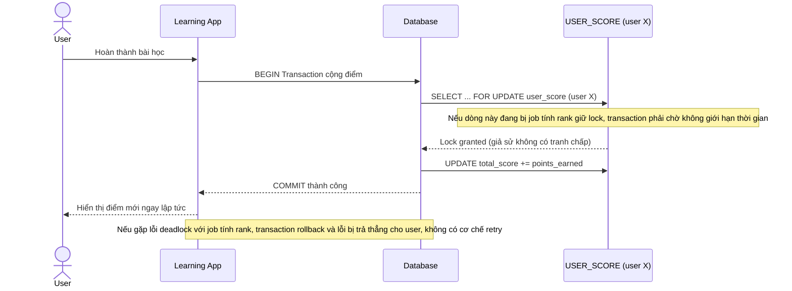

# Base sequence — Complete lesson (cộng điểm, không retry, không timeout)

Đây là **base**, flow cộng điểm khi user hoàn thành bài học ở trạng thái hiện tại: transaction lock trực tiếp dòng `USER_SCORE` của user đó, không có retry khi gặp lỗi deadlock, không có lock timeout — nếu job tính rank đang giữ lock lâu, transaction này sẽ chờ vô thời hạn hoặc lỗi thẳng ra user. Flow này là tiền đề cho yêu cầu 2 và 4 của đề bài.

