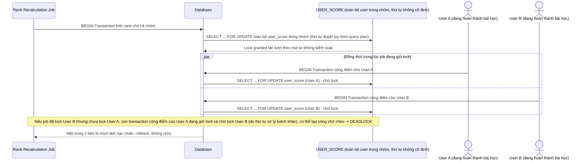

# Base sequence — Job tính lại rank (lock cả nhóm cùng lúc, không sort user_id)

Đây là **base**, flow job nền tính lại thứ hạng leaderboard ở trạng thái hiện tại: job đọc/update toàn bộ user trong 1 nhóm cùng lúc, không sort theo `user_id`, không chia batch nhỏ. Khi chạy song song với các transaction cộng điểm real-time, đây chính là nguồn gốc rủi ro deadlock nêu ở yêu cầu 1 của đề bài.

