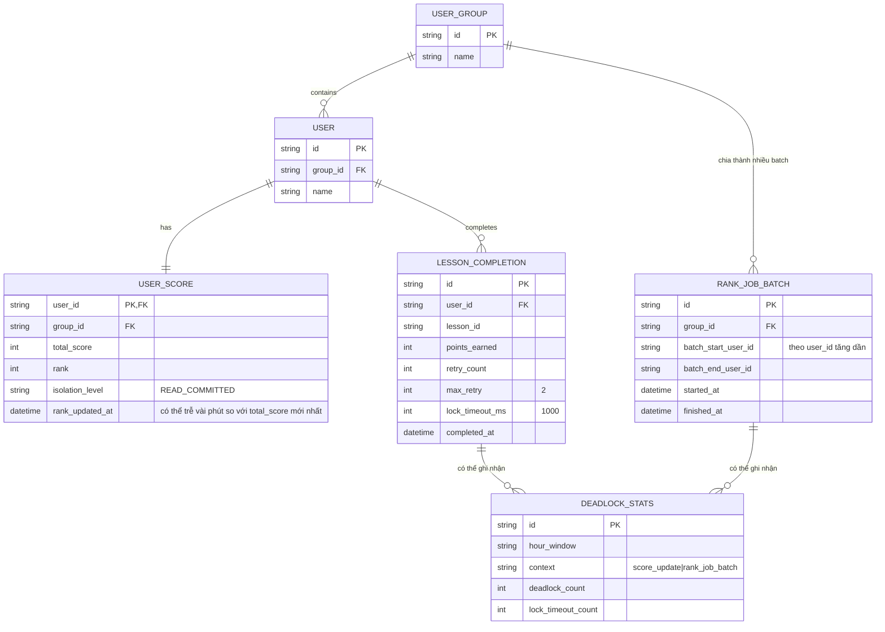

# Enhance ERD — Batch nhỏ theo user_id, retry, lock timeout và đo tỷ lệ deadlock

Đây là ERD **sau khi** enhance được áp dụng lên base. So với base, có thêm 2 entity mới và bổ sung trường theo dõi cấu hình vào các entity hiện có, ứng trực tiếp với các yêu cầu:

- `RANK_JOB_BATCH` (mới) — job tính rank chia nhóm thành nhiều batch nhỏ, mỗi batch lock user_id tăng dần, đáp ứng yêu cầu 1.
- `LESSON_COMPLETION` thêm `retry_count`, `max_retry`, `lock_timeout_ms` — đáp ứng yêu cầu 2 (retry tối đa 2 lần trong 500ms) và yêu cầu 4 (lock timeout 1 giây cho transaction cộng điểm).
- `USER_SCORE.isolation_level`/`rank_updated_at` (giữ nguyên nhưng nay phản ánh rank có thể hơi trễ) — minh họa trade-off ở yêu cầu 3 (READ COMMITTED, chấp nhận nhất quán tương đối).
- `DEADLOCK_STATS` (mới) — đo và log tỷ lệ deadlock/lock-timeout theo giờ, đáp ứng yêu cầu 5.

