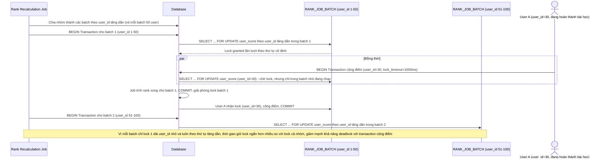

# Enhance sequence — Job tính lại rank (batch nhỏ, lock theo user_id tăng dần)

Đây là **enhance** của flow `recalculate-rank-job` đã có ở base. So với base (lock cả nhóm cùng lúc, thứ tự không kiểm soát), nay job chia nhóm thành nhiều `RANK_JOB_BATCH` nhỏ, mỗi batch chỉ lock 1 khoảng `user_id` liên tiếp theo thứ tự tăng dần, giảm đáng kể collision với các transaction cộng điểm real-time. Đáp ứng yêu cầu 1 của đề bài.

