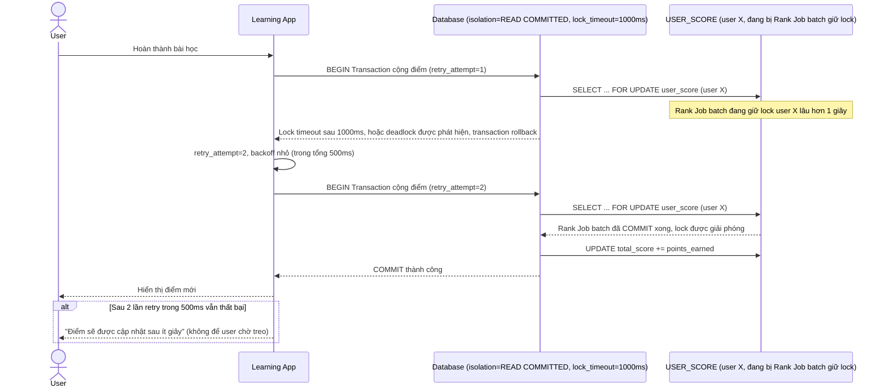

# Enhance sequence — Complete lesson (retry nhanh + lock timeout ngắn)

Đây là **enhance** của flow `complete-lesson` đã có ở base. So với base (không retry, không timeout, có thể chờ vô thời hạn nếu job rank đang giữ lock), nay transaction cộng điểm có `lock_timeout_ms=1000` và tự động retry tối đa 2 lần trong 500ms khi gặp deadlock, ưu tiên UX real-time của user. Đáp ứng yêu cầu 2 và 4 của đề bài.

