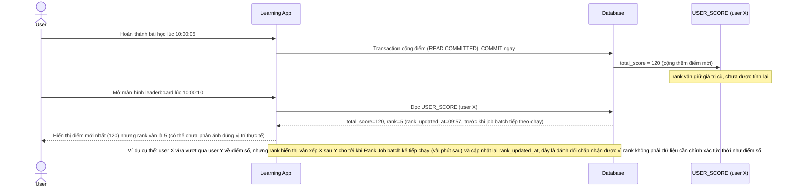

# Enhance sequence — Xem leaderboard (chấp nhận rank trễ vài phút, đổi lấy UX nhanh)

Đây là **enhance**, flow mới minh họa trade-off giữa isolation level nhanh cho transaction cộng điểm và độ trễ chấp nhận được của rank. Đáp ứng yêu cầu 3 của đề bài: `READ COMMITTED` cho transaction cộng điểm giúp UX nhanh, nhưng rank hiển thị cho user có thể trễ tới khi job batch tiếp theo chạy xong, không cần chính xác tuyệt đối theo thời gian thực.

