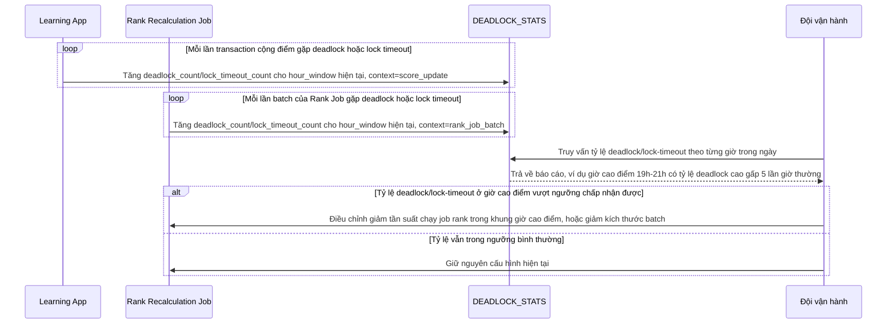

# Enhance sequence — Đo và log tỷ lệ deadlock/lock-timeout theo giờ cao điểm

Đây là **enhance**, flow hoàn toàn mới, chưa tồn tại ở base. Đáp ứng yêu cầu 5 của đề bài: đo và log tỷ lệ deadlock/lock-timeout theo giờ để xác định có cần điều chỉnh tần suất chạy job rank hay không.

