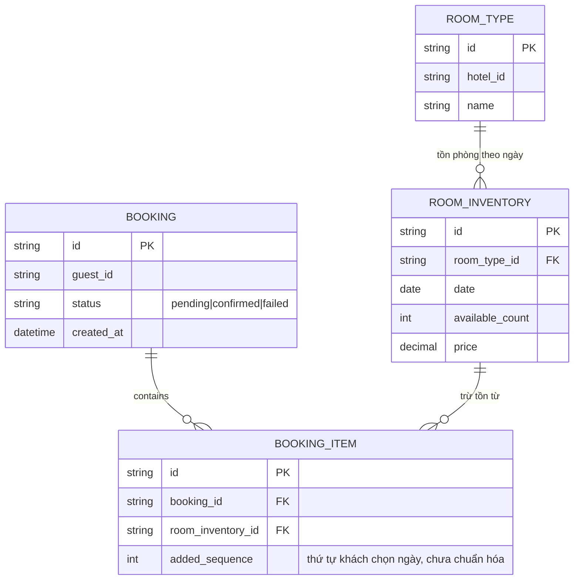

# Base ERD — Đặt phòng và cập nhật giá chưa có chiến lược lock rõ ràng

Đây là **base**: trạng thái nền tảng đặt phòng khách sạn *trước khi* áp dụng `SELECT ... FOR UPDATE` tường minh, chuẩn hóa thứ tự lock và timeout cho admin. Suy luận từ đề bài, base đã có `ROOM_TYPE`, `ROOM_INVENTORY` (tồn phòng và giá theo từng `room_type` + `date`), `BOOKING` và `BOOKING_ITEM` (mỗi đêm khách đặt là 1 dòng, theo đúng thứ tự khách chọn ngày, chưa chuẩn hóa). Base chưa có ràng buộc nào về isolation level hay timeout khi admin và khách cùng chạm 1 dòng `ROOM_INVENTORY`.

