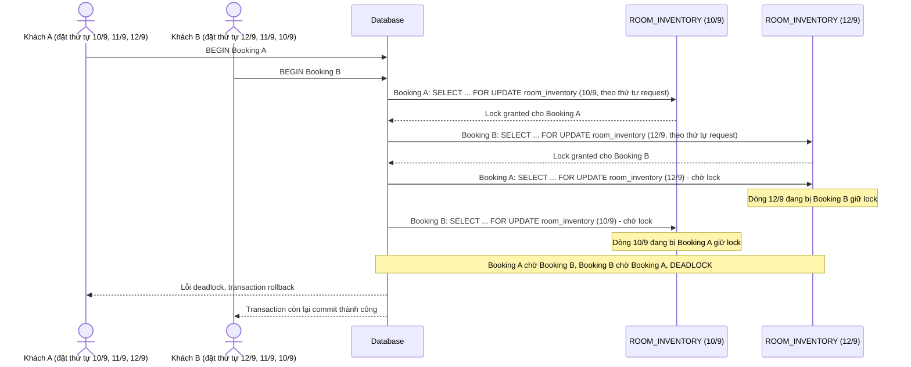

# Base sequence — Book room (lock theo thứ tự ngày khách chọn, gây deadlock đặt đa-ngày chồng lấn)

Đây là **base**, flow đặt phòng ở trạng thái hiện tại: transaction lock các dòng `ROOM_INVENTORY` theo đúng thứ tự ngày mà request gửi lên (không sort lại). Đây chính là kịch bản deadlock nêu ở yêu cầu 2 của đề bài — 1 request đặt theo thứ tự [10/9, 11/9, 12/9], request khác đặt cùng room_type theo thứ tự [12/9, 11/9, 10/9].

