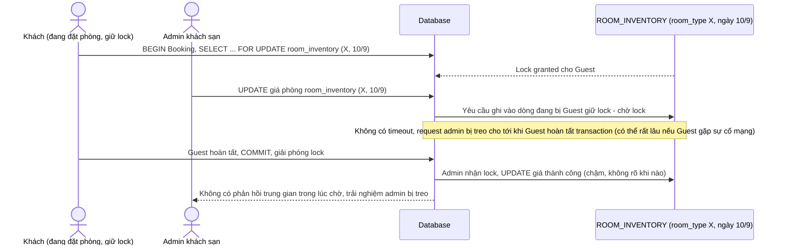

# Base sequence — Admin update price (không timeout, có thể treo vô hạn hoặc đọc giá stale)

Đây là **base**, flow admin cập nhật giá/tồn phòng ở trạng thái hiện tại: khi khách đang giữ lock trừ tồn cho đúng phòng/ngày đó, request admin không có timeout rõ ràng nên có thể chờ vô hạn, hoặc nếu không lock tường minh thì đọc phải giá cũ (stale) rồi ghi đè sai. Đây là tiền đề cho yêu cầu 1 và 4 của đề bài.

