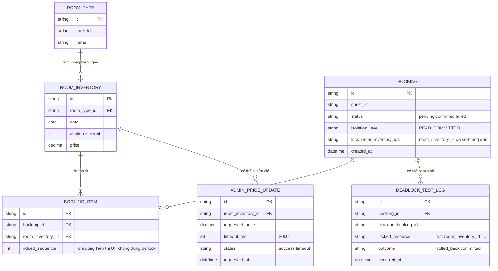

# Enhance ERD — Chuẩn hóa thứ tự lock, isolation level tường minh và timeout cho admin

Đây là ERD **sau khi** enhance được áp dụng lên base. So với base, `BOOKING` thêm các trường kiểm soát isolation/thứ tự lock, và có thêm entity mới `ADMIN_PRICE_UPDATE` để quản lý timeout khi admin sửa giá, ứng trực tiếp với các yêu cầu:

- `BOOKING.lock_order_inventory_ids`, `isolation_level` — đáp ứng yêu cầu 1 (chỉ `SELECT ... FOR UPDATE` đúng row cần trừ tồn), yêu cầu 2 (chuẩn hóa thứ tự lock theo khóa chính tăng dần) và yêu cầu 3 (READ COMMITTED thay vì SERIALIZABLE toàn bộ).
- `ADMIN_PRICE_UPDATE` (mới) — ghi nhận `timeout_ms` và `status` khi admin sửa giá đúng lúc khách giữ lock, đáp ứng yêu cầu 4.
- `DEADLOCK_TEST_LOG` (mới) — phục vụ test giả lập 2 transaction chồng lấn ngược thứ tự, đáp ứng yêu cầu 5.

