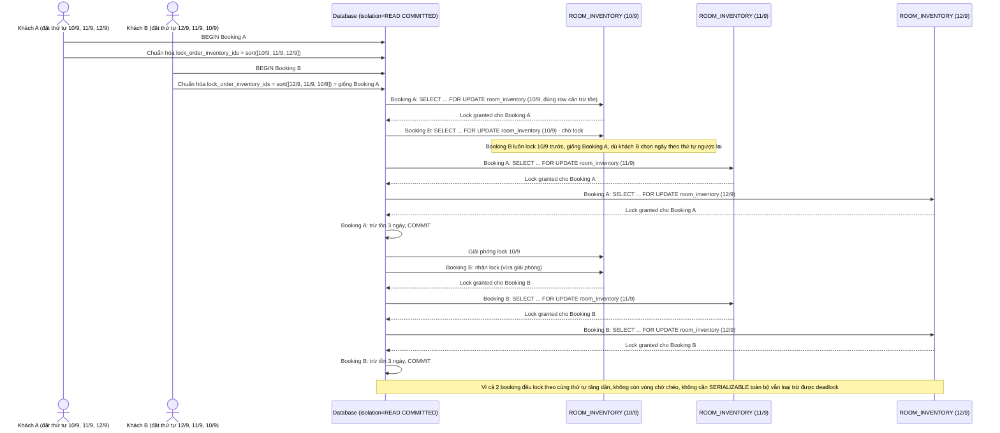

# Enhance sequence — Book room (chỉ FOR UPDATE đúng row, lock theo khóa chính tăng dần)

Đây là **enhance** của flow `book-room` đã có ở base. So với base (lock theo thứ tự request, gây deadlock), nay transaction chỉ `SELECT ... FOR UPDATE` đúng các row (room_type, date) cần trừ tồn — không lock nguyên bảng — và luôn sort `room_inventory_id` tăng dần trước khi lock, bất kể thứ tự khách chọn ngày. Đáp ứng yêu cầu 1, 2 và 3 của đề bài.

