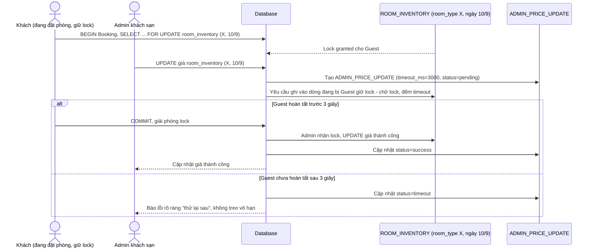

# Enhance sequence — Admin update price (timeout rõ ràng, không treo vô hạn)

Đây là **enhance** của flow `admin-update-price` đã có ở base. So với base (không timeout, có thể treo vô hạn), nay request admin có `timeout_ms=3000` khi chờ lock của khách đang trừ tồn cùng row, và trả lỗi rõ ràng "thử lại sau" khi timeout thay vì treo vô thời hạn. Đáp ứng yêu cầu 4 của đề bài.

