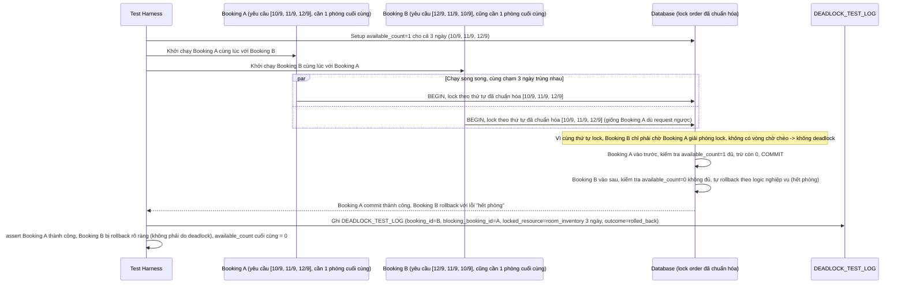

# Enhance sequence — Test 2 booking chồng lấn lock theo thứ tự ngược nhau

Đây là **enhance**, flow mới mô tả kịch bản test tự động hoá. Đáp ứng yêu cầu 5 của đề bài: dựng 2 transaction giả lập chồng lấn lock theo thứ tự ngày ngược nhau, cùng tranh chấp phòng cuối cùng còn trống, xác nhận hệ thống tự phát hiện/rollback một bên (do hết phòng khi đến lượt, không phải do deadlock — deadlock đã bị loại trừ nhờ chuẩn hóa thứ tự lock) và request còn lại thành công.

