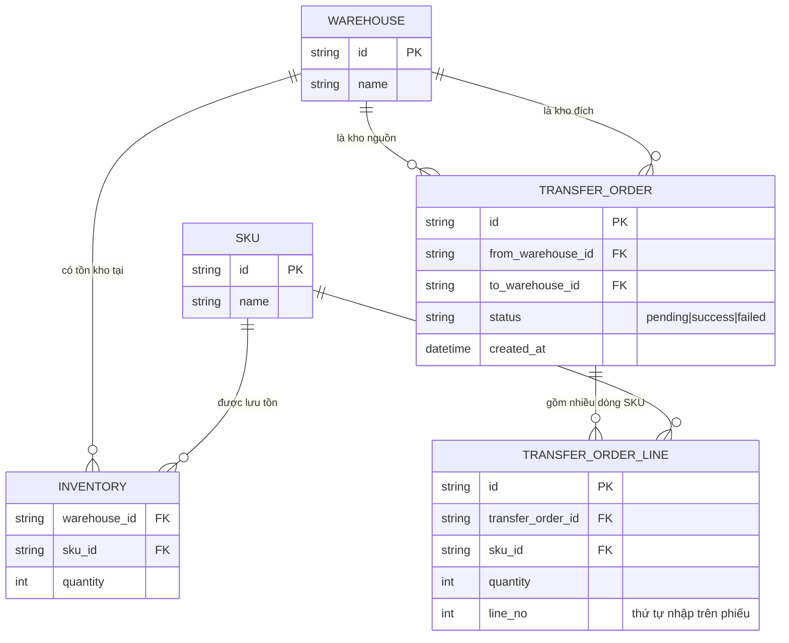

# Base ERD — Quản lý kho vận chưa có cơ chế chống deadlock khi chuyển hàng liên kho

Đây là **base**: trạng thái hệ thống kho vận *trước khi* áp dụng thứ tự lock toàn cục, lock trước toàn bộ dòng, retry đọc lại tồn kho, và chọn isolation level tường minh. Suy luận từ đề bài, base đã có `WAREHOUSE` chứa nhiều `SKU` qua bảng tồn kho `INVENTORY` (mỗi dòng là 1 cặp kho-SKU với số lượng tồn), và nhân viên tạo `TRANSFER_ORDER` (phiếu chuyển) giữa 1 kho nguồn và 1 kho đích, mỗi phiếu gồm nhiều `TRANSFER_ORDER_LINE` (mỗi dòng là 1 SKU với số lượng cần chuyển, giữ nguyên thứ tự nhập trên phiếu). Base chưa có bất kỳ cơ chế chuẩn hoá thứ tự lock nào, cũng chưa ghi log deadlock.

