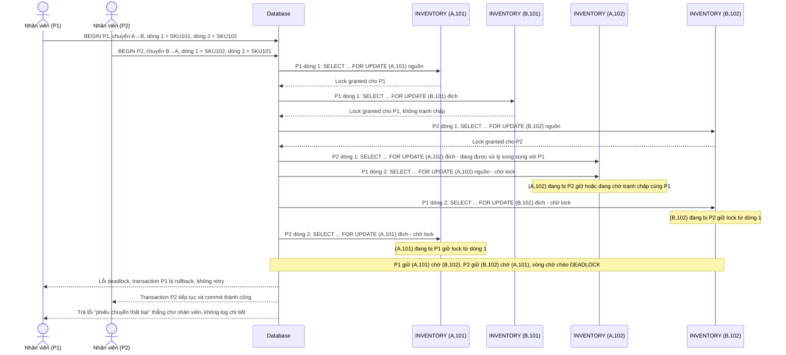

# Base sequence — Process transfer order (lock theo kho nguồn trước, thứ tự nhập trên phiếu, dẫn tới deadlock)

Đây là **base**, flow xử lý phiếu chuyển hàng ở trạng thái hiện tại: mỗi transaction lock các dòng tồn kho theo thứ tự "kho nguồn trước, rồi từng SKU theo thứ tự nhập trên phiếu", không chuẩn hoá theo composite key toàn cục. Đây chính là kịch bản deadlock kinh điển nêu ở yêu cầu 1 của đề bài: phiếu P1 (kho A sang kho B, SKU 101 rồi 102) và phiếu P2 (kho B sang kho A, SKU 102 rồi 101) chạy song song, để đơn giản minh hoạ, sơ đồ chỉ nhấn mạnh 2 lock cuối cùng hình thành vòng chờ chéo, các lock không tranh chấp khác (dòng đầu của mỗi phiếu) được lược bớt.

