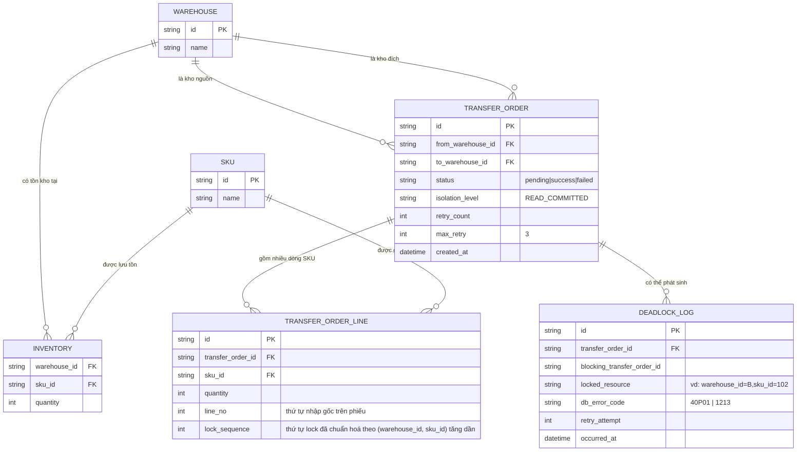

# Enhance ERD — Thêm thứ tự lock toàn cục, retry đọc lại tồn kho, isolation level tường minh và deadlock logging

Đây là ERD **sau khi** enhance được áp dụng lên base. So với base, `TRANSFER_ORDER_LINE` có thêm trường `lock_sequence` (thứ tự lock đã chuẩn hoá theo composite key `(warehouse_id, sku_id)` tăng dần, tách biệt với `line_no` là thứ tự nhập gốc trên phiếu), `TRANSFER_ORDER` thêm `isolation_level`, `retry_count`, `max_retry`, và có thêm entity mới `DEADLOCK_LOG`, ứng trực tiếp với các yêu cầu:

- `TRANSFER_ORDER_LINE.lock_sequence` — đáp ứng yêu cầu 1 (chuẩn hoá thứ tự lock toàn cục theo composite key, bất kể chiều chuyển hay thứ tự nhập) và yêu cầu 2 (lock hết toàn bộ dòng nguồn lẫn đích theo thứ tự này trước khi xử lý bất kỳ dòng nào).
- `TRANSFER_ORDER.isolation_level` — đáp ứng yêu cầu 4 (chọn `READ COMMITTED` tường minh thay vì mặc định `REPEATABLE READ`).
- `TRANSFER_ORDER.retry_count`/`max_retry` — đáp ứng yêu cầu 3 (retry tự động, đọc lại tồn kho hiện tại tại thời điểm retry).
- `DEADLOCK_LOG` (mới) — ghi chi tiết mỗi lần deadlock xảy ra dù đã chuẩn hoá thứ tự lock, dữ liệu này cũng phục vụ test invariant ở yêu cầu 5.

