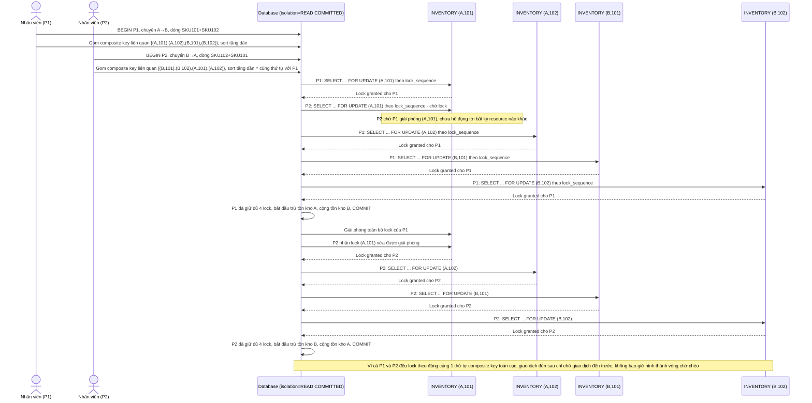

# Enhance sequence — Process transfer order (lock toàn bộ dòng theo composite key toàn cục, loại trừ deadlock)

Đây là **enhance** của flow `process-transfer-order` đã có ở base. So với base (lock rải rác theo "nguồn trước, thứ tự nhập trên phiếu" gây deadlock), nay mỗi transaction gom toàn bộ dòng liên quan (cả nguồn lẫn đích) thành 1 danh sách composite key `(warehouse_id, sku_id)`, sắp xếp tăng dần, rồi lock hết theo đúng thứ tự này ngay từ đầu trước khi trừ/cộng bất kỳ dòng nào. Đáp ứng yêu cầu 1 và 2 của đề bài.

