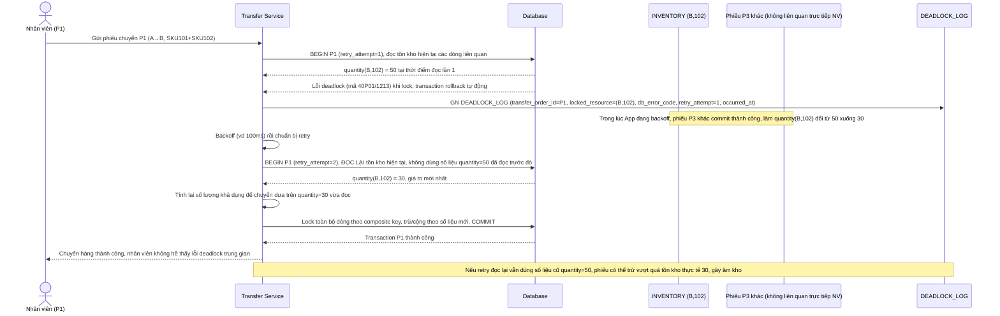

# Enhance sequence — Retry tự động đọc lại tồn kho hiện tại, không dùng số liệu cũ

Đây là **enhance**, flow mới bổ sung cho trường hợp deadlock vẫn xảy ra dù đã chuẩn hoá thứ tự lock (ví dụ 3 phiếu chồng lấn SKU cùng lúc tạo tranh chấp ngoài dự kiến). Đáp ứng yêu cầu 3 của đề bài: khi bị rollback do deadlock, transaction phải retry tự động nhưng bắt buộc đọc lại tồn kho hiện tại tại thời điểm retry, không tái sử dụng số liệu đã đọc ở lần thử trước, vì trong lúc chờ retry có thể đã có phiếu khác làm thay đổi tồn kho các dòng liên quan.

