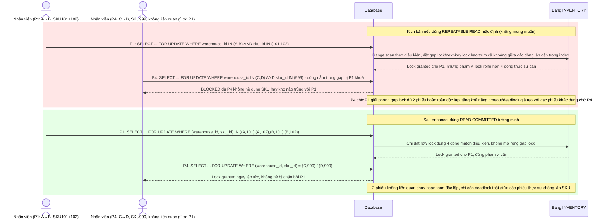

# Enhance sequence — Vì sao chọn READ COMMITTED thay vì REPEATABLE READ mặc định

Đây là **enhance**, sơ đồ minh hoạ lý do lựa chọn kỹ thuật chứ không phải 1 flow nghiệp vụ đơn thuần, đáp ứng yêu cầu 4 của đề bài: giải thích cụ thể vì sao `REPEATABLE READ` (mặc định của một số DB như MySQL/InnoDB) có thể mở rộng phạm vi lock qua gap lock/range lock, ảnh hưởng tới các phiếu chuyển kho khác không hề liên quan tới cùng SKU, làm tăng deadlock giả tạo — trong khi `READ COMMITTED` chỉ lock đúng các dòng đã match.

