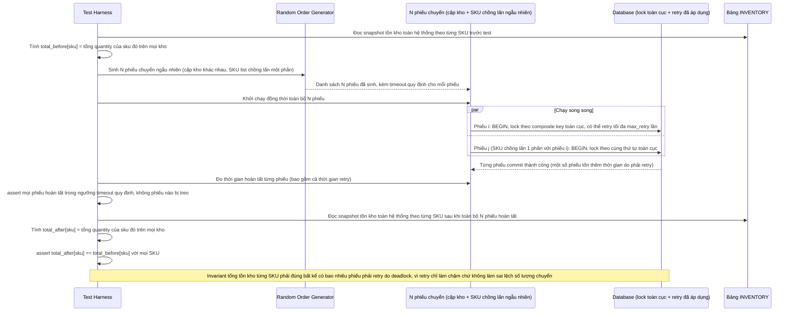

# Enhance sequence — Test hàng loạt phiếu chuyển ngẫu nhiên, assert invariant tổng tồn kho và timeout

Đây là **enhance**, flow mới mô tả kịch bản test tự động hoá. Đáp ứng yêu cầu 5 của đề bài: dựng nhiều phiếu chuyển ngẫu nhiên giữa các cặp kho khác nhau với danh sách SKU chồng lấn một phần, chạy song song hàng loạt, assert tổng tồn kho từng SKU trên toàn hệ thống bất biến trước/sau, và không có phiếu nào bị treo vượt quá timeout quy định dù đã tính cả thời gian retry.

