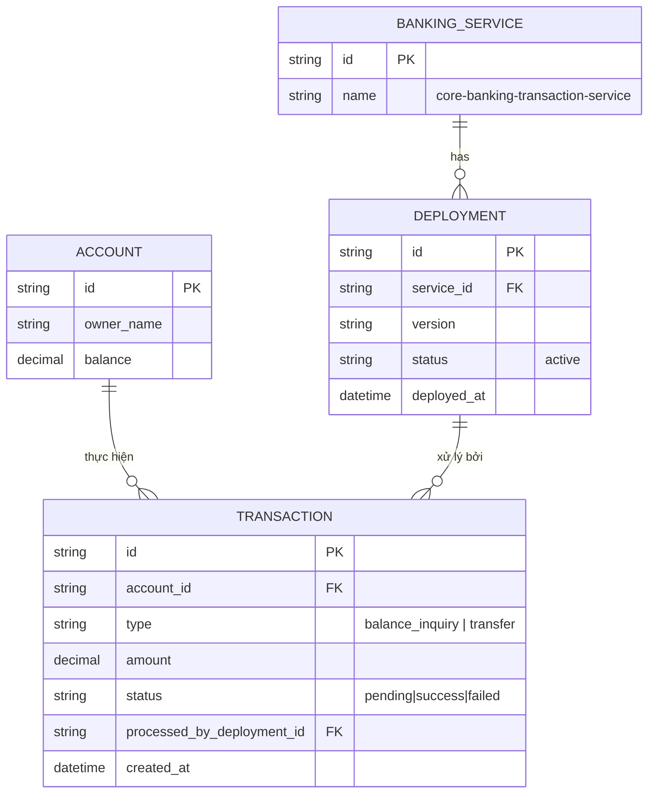

# Base ERD — Core banking service trước khi có quy trình canary kiểm soát chặt và audit

Đây là **base**: trạng thái hệ thống core banking *trước khi* áp dụng quy trình canary có phê duyệt, audit log bất biến, đối soát song song, và kế hoạch rollback dữ liệu. Suy luận từ đề bài, base đã có `BANKING_SERVICE` với các `DEPLOYMENT` (mỗi lần chỉ có 1 bản đang chạy chính thức), `ACCOUNT` của khách hàng, và `TRANSACTION` (gồm cả loại xem số dư lẫn chuyển tiền) được xử lý bởi bản deployment đang active. Base chưa phân biệt rủi ro theo loại giao dịch, chưa có audit log, chưa có bước phê duyệt, và chưa có cơ chế đối soát song song hay kế hoạch dữ liệu khi rollback.

