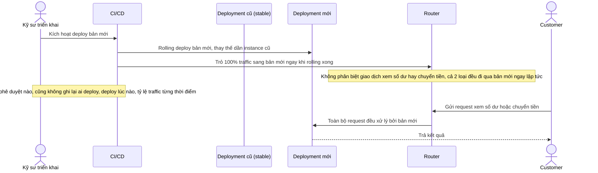

# Base sequence — Deploy (chuyển thẳng 100% traffic, không phân biệt loại giao dịch, không phê duyệt)

Đây là **base**, flow "Deploy core banking service" ở trạng thái hiện tại: sau khi rolling deploy xong, router chuyển thẳng 100% traffic sang bản mới cho mọi loại giao dịch (cả xem số dư lẫn chuyển tiền) cùng lúc, không có giai đoạn tăng dần theo mức độ rủi ro, không cần ai phê duyệt, và không ghi lại quyết định deploy vào đâu cả. Flow này là nền để so sánh với yêu cầu 1, 2 và 5 của đề bài.

