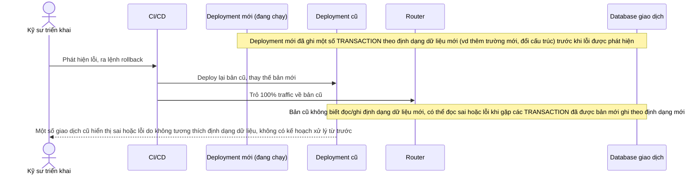

# Base sequence — Rollback (chỉ rollback mã nguồn, chưa tính tới dữ liệu)

Đây là **base**, flow rollback ở trạng thái hiện tại: khi phát hiện lỗi, kỹ sư chỉ rollback mã nguồn về bản cũ, không có kế hoạch xử lý dữ liệu mà bản mới đã ghi ở định dạng mới trong lúc đang chạy. Đây chính là khoảng trống mà yêu cầu 4 của đề bài nhắm tới xử lý.

