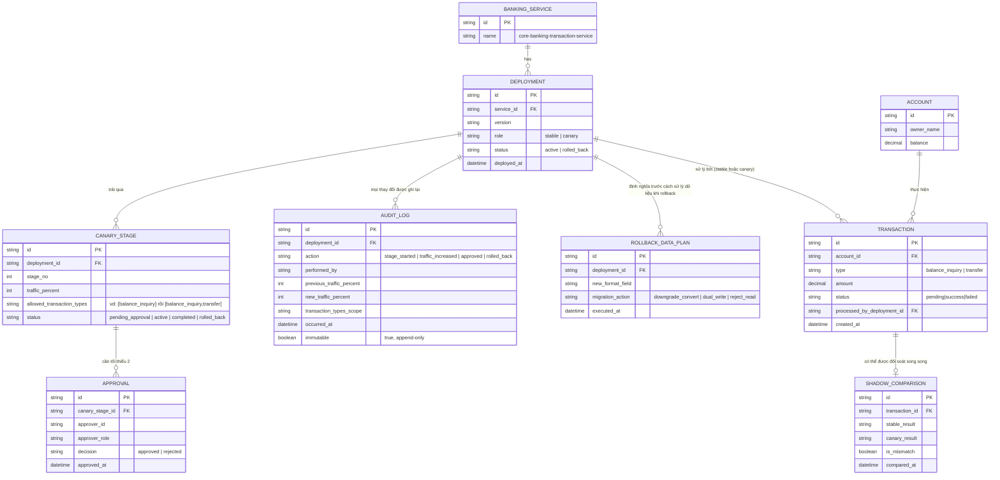

# Enhance ERD — Canary có kiểm soát rủi ro giao dịch, phê duyệt four-eyes, audit log bất biến, đối soát song song

Đây là ERD **sau khi** enhance được áp dụng lên base. So với base, có 5 nhóm thay đổi chính, ứng trực tiếp với 5 yêu cầu trong đề bài:

- `CANARY_STAGE` (mới) — mỗi deployment canary trải qua nhiều giai đoạn, mỗi giai đoạn giới hạn `allowed_transaction_types` (bắt đầu chỉ `balance_inquiry`, sau mới mở rộng sang `transfer`) thay vì chia đều theo tỷ lệ traffic ngẫu nhiên — đáp ứng yêu cầu 2.
- `APPROVAL` (mới) — mỗi `CANARY_STAGE` cần tối thiểu 2 approval từ 2 người khác nhau trước khi chuyển sang giai đoạn kế tiếp hoặc mở lên 100% — đáp ứng yêu cầu 5 (four-eyes).
- `AUDIT_LOG` (mới) — ghi lại mọi hành động trên deployment (bắt đầu canary, tăng tỷ lệ/mở rộng loại giao dịch, phê duyệt, rollback), không thể sửa/xoá (append-only) — đáp ứng yêu cầu 1.
- `SHADOW_COMPARISON` (mới) — mỗi `TRANSACTION` liên quan tới tính toán số dư/giao dịch có thể được gửi song song tới cả bản stable và canary, so sánh kết quả, chỉ trả về kết quả bản đang chính thức — đáp ứng yêu cầu 3.
- `ROLLBACK_DATA_PLAN` (mới) — định nghĩa trước cách xử lý dữ liệu đã ghi theo định dạng mới khi phải rollback (convert ngược, dual-write tạm thời, hay từ chối đọc) — đáp ứng yêu cầu 4.

