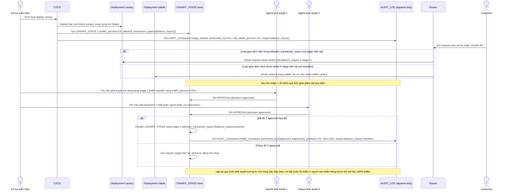

# Enhance sequence — Deploy (canary theo rủi ro giao dịch, four-eyes approval, audit log mỗi bước)

Đây là **enhance** của flow `deploy` đã có ở base. So với base (chuyển thẳng 100% traffic cho mọi loại giao dịch, không phê duyệt, không ghi log), nay canary bắt đầu chỉ phục vụ giao dịch rủi ro thấp (`balance_inquiry`), mỗi lần mở rộng loại giao dịch hoặc tăng tỷ lệ traffic đều cần tối thiểu 2 người phê duyệt (four-eyes), và mọi bước đều ghi vào `AUDIT_LOG` bất biến. Đáp ứng yêu cầu 1, 2 và 5 của đề bài.

