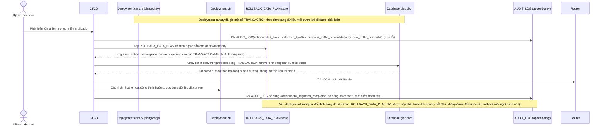

# Enhance sequence — Rollback (kèm kế hoạch xử lý dữ liệu định dạng mới, ghi audit log)

Đây là **enhance** của flow `rollback` đã có ở base. So với base (chỉ rollback mã nguồn, không có kế hoạch dữ liệu, không ghi log), nay rollback bắt buộc thực thi `ROLLBACK_DATA_PLAN` đã định nghĩa trước để xử lý các dòng dữ liệu đã ghi theo định dạng mới, và mọi bước rollback đều ghi vào `AUDIT_LOG` bất biến. Đáp ứng yêu cầu 1 và 4 của đề bài.

