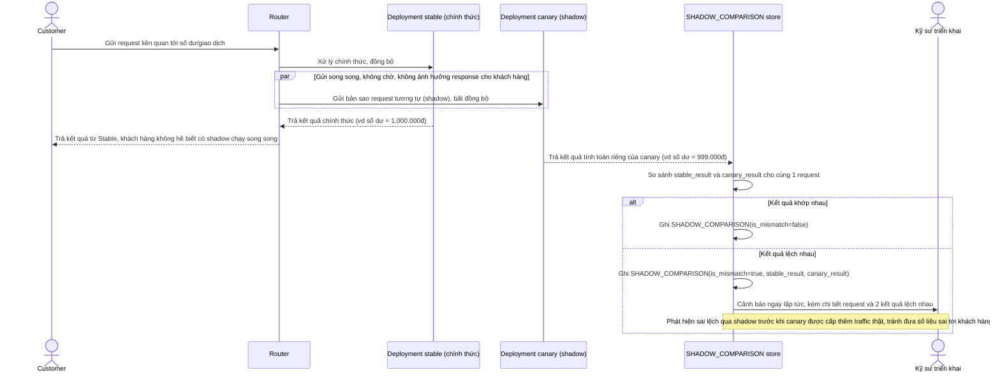

# Enhance sequence — Đối soát song song (shadow) giữa bản stable và canary

Đây là **enhance**, flow hoàn toàn mới, chưa tồn tại ở base. Đáp ứng yêu cầu 3 của đề bài: mọi thay đổi liên quan tới tính toán số dư/giao dịch phải chạy shadow — gửi cùng request tới cả bản stable và canary, so sánh kết quả, nhưng chỉ trả về kết quả từ bản đang chính thức — để phát hiện sai lệch trước khi thực sự chuyển traffic sang canary.

