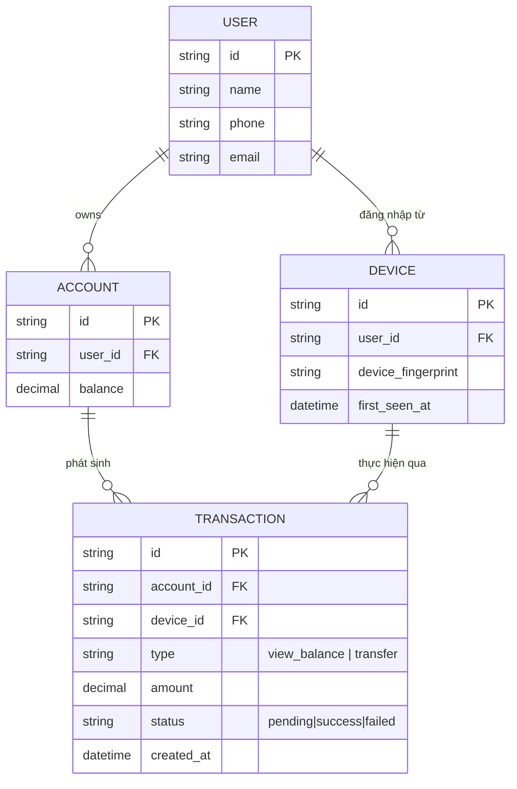

# Base ERD — Ngân hàng số chưa phân biệt mức độ tin cậy thiết bị

Đây là **base**: trạng thái hệ thống ngân hàng số *trước khi* có cơ chế device trust theo tầng. Suy luận từ đề bài, base đã có `USER` sở hữu nhiều `ACCOUNT`, đăng nhập từ các `DEVICE` khác nhau (ghi nhận fingerprint, lần đầu thấy), và mỗi `TRANSACTION` (xem số dư hoặc chuyển tiền) được thực hiện qua 1 thiết bị cụ thể. Base chưa phân biệt thiết bị mới hay cũ, chưa có khái niệm mức trust, nên bất kỳ thiết bị nào đăng nhập thành công (đúng mật khẩu/MFA) đều có toàn quyền thực hiện mọi giao dịch kể cả chuyển tiền giá trị lớn ngay lập tức.

