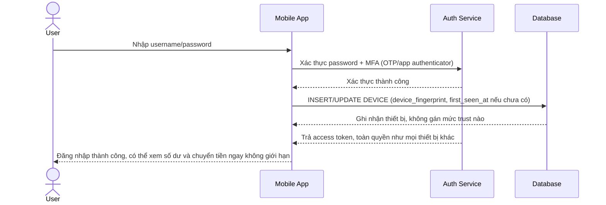

# Base sequence — Login (không phân biệt mức trust thiết bị)

Đây là **base**, flow đăng nhập ở trạng thái hiện tại: sau khi xác thực đúng mật khẩu/MFA, thiết bị (mới hay cũ) đều được cấp toàn quyền truy cập như nhau, hệ thống chỉ ghi nhận fingerprint thiết bị mà không gán mức trust nào. Đây là nền để so sánh với yêu cầu 1 và 3 của đề bài (cần phân tầng trust và phân biệt thiết bị mới thật sự với thiết bị cài lại app).

