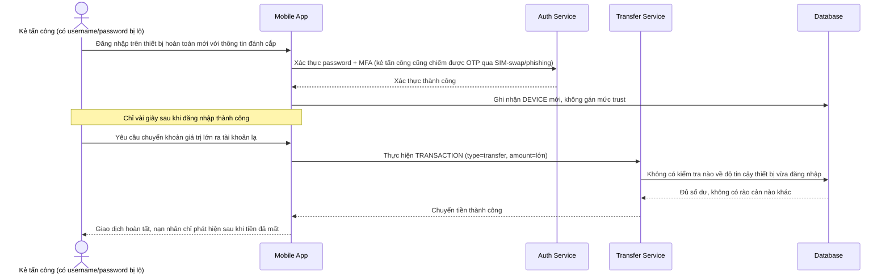

# Base sequence — Transfer money (không kiểm tra trust thiết bị, lộ rủi ro kẻ tấn công)

Đây là **base**, flow chuyển tiền ở trạng thái hiện tại: sau khi đăng nhập thành công, thiết bị được phép chuyển tiền với bất kỳ số tiền nào ngay lập tức, không có bước kiểm tra mức độ tin cậy thiết bị. Sơ đồ minh hoạ đúng kịch bản rủi ro nêu ở yêu cầu 2 của đề bài: kẻ tấn công chiếm được thông tin đăng nhập, đăng nhập trên thiết bị mới rồi chuyển tiền lớn thành công chỉ trong vài giây.

