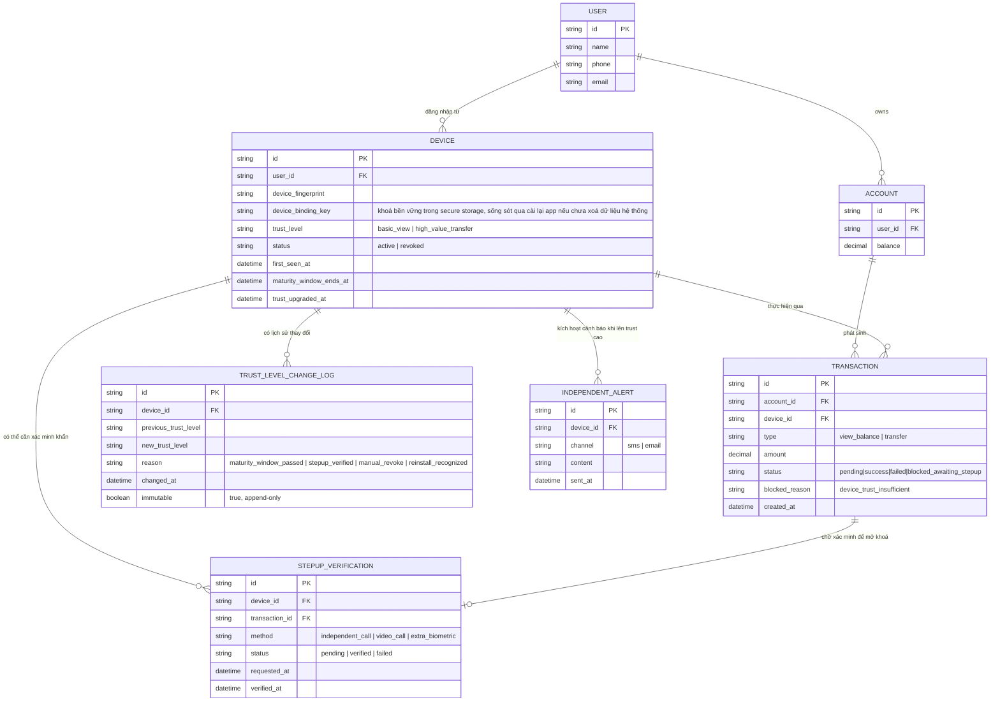

# Enhance ERD — Device trust theo tầng, cửa sổ maturity, step-up khẩn cấp, audit trail và cảnh báo độc lập

Đây là ERD **sau khi** enhance được áp dụng lên base. So với base, `DEVICE` được bổ sung nhiều trường theo dõi mức trust, và có 3 entity mới, ứng trực tiếp với các yêu cầu:

- `DEVICE.trust_level`, `device_binding_key`, `maturity_window_ends_at` — đáp ứng yêu cầu 1 (thiết bị mới chỉ ở `basic_view`, phải qua cửa sổ maturity mới lên `high_value_transfer`) và yêu cầu 3 (`device_binding_key` là khoá bền vững lưu ở secure storage của hệ điều hành, dùng để nhận diện thiết bị cũ cài lại app thay vì coi là thiết bị hoàn toàn mới).
- `TRUST_LEVEL_CHANGE_LOG` (mới) — ghi lại mọi lần nâng/hạ/thu hồi trust, không thể sửa đổi — đáp ứng vế đầu yêu cầu 5 (audit trail).
- `STEPUP_VERIFICATION` (mới) — gắn với `TRANSACTION` bị chặn vì thiết bị chưa đủ trust, cho phép xác minh khẩn cấp qua kênh độc lập để nâng trust ngay, bỏ qua thời gian chờ maturity — đáp ứng yêu cầu 4.
- `INDEPENDENT_ALERT` (mới) — gửi SMS/email độc lập mỗi khi thiết bị đạt mức trust cho giao dịch lớn — đáp ứng vế sau yêu cầu 5.
- `TRANSACTION.blocked_reason` — đáp ứng yêu cầu 2 (mặc định từ chối giao dịch lớn khi trust chưa đủ, kể cả ngay sau khi vừa đăng nhập).

