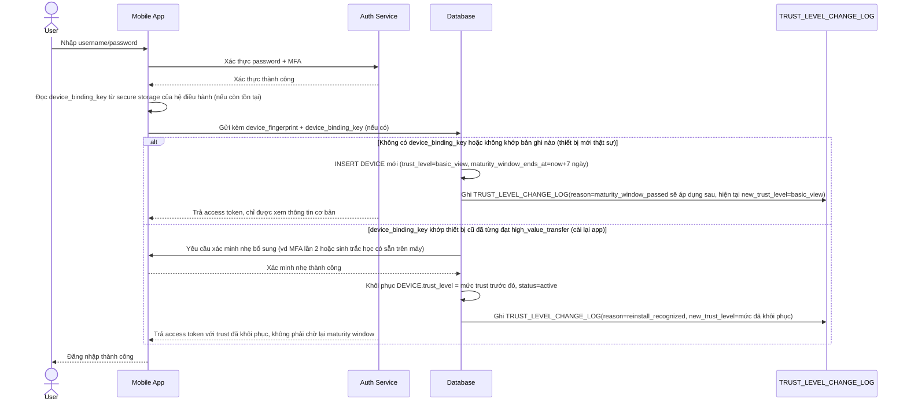

# Enhance sequence — Login (phân biệt thiết bị mới thật sự với thiết bị cũ cài lại app)

Đây là **enhance** của flow `login` đã có ở base. So với base (mọi thiết bị đăng nhập thành công đều có toàn quyền như nhau), nay thiết bị mới được gán `trust_level=basic_view` mặc định, còn nếu hệ thống nhận diện được `device_binding_key` khớp với thiết bị đã từng đạt trust cao trước đó (cài lại app, chưa xoá secure storage), trust được khôi phục sau một bước xác minh nhẹ thay vì reset về mức thấp nhất. Đáp ứng yêu cầu 1 và 3 của đề bài.

