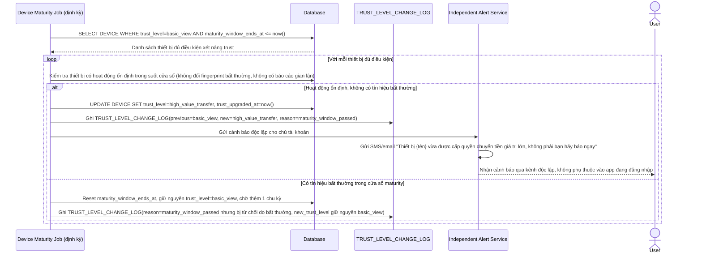

# Enhance sequence — Nâng trust thiết bị sau cửa sổ maturity, cảnh báo qua kênh độc lập

Đây là **enhance**, flow hoàn toàn mới, chưa tồn tại ở base. Một job định kỳ kiểm tra các thiết bị đã hoạt động ổn định qua đủ thời gian maturity window để nâng trust lên `high_value_transfer`, ghi audit trail bất biến và gửi cảnh báo ngay qua kênh độc lập (SMS/email) cho chủ tài khoản. Đáp ứng yêu cầu 1 (cửa sổ maturity) và yêu cầu 5 (audit trail + cảnh báo độc lập) của đề bài.

