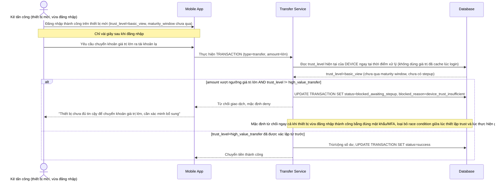

# Enhance sequence — Transfer money (kiểm tra trust thiết bị, mặc định từ chối khi chưa đủ, chặn race condition)

Đây là **enhance** của flow `transfer-money` đã có ở base. So với base (chuyển tiền không kiểm tra gì), nay mọi giao dịch vượt ngưỡng giá trị lớn bắt buộc kiểm tra `DEVICE.trust_level=high_value_transfer` ngay tại thời điểm xử lý giao dịch (không dựa vào trạng thái đã cache lúc login), mặc định từ chối nếu thiết bị chưa đạt mức trust này — kể cả khi vừa đăng nhập xong vài giây trước. Đáp ứng yêu cầu 2 của đề bài, tái hiện đúng kịch bản tấn công ở base nhưng lần này bị chặn.

