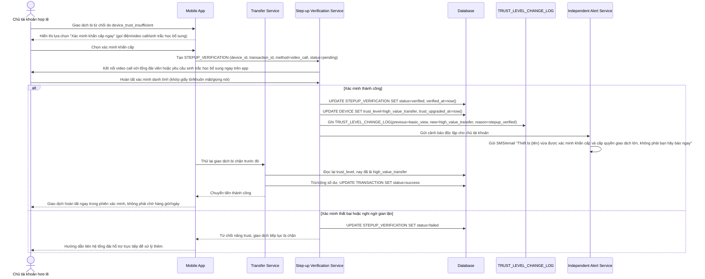

# Enhance sequence — Step-up khẩn cấp qua kênh độc lập cho giao dịch gấp hợp lệ

Đây là **enhance**, flow hoàn toàn mới, chưa tồn tại ở base. Khi giao dịch bị chặn vì thiết bị chưa đủ trust nhưng người dùng hợp lệ thực sự cần gấp, họ có thể yêu cầu xác minh bổ sung qua kênh độc lập (gọi điện, video call, sinh trắc học bổ sung) để nâng trust ngay lập tức thay vì chờ hết maturity window. Đáp ứng yêu cầu 4, đồng thời vẫn đảm bảo audit trail và cảnh báo độc lập theo yêu cầu 5.

